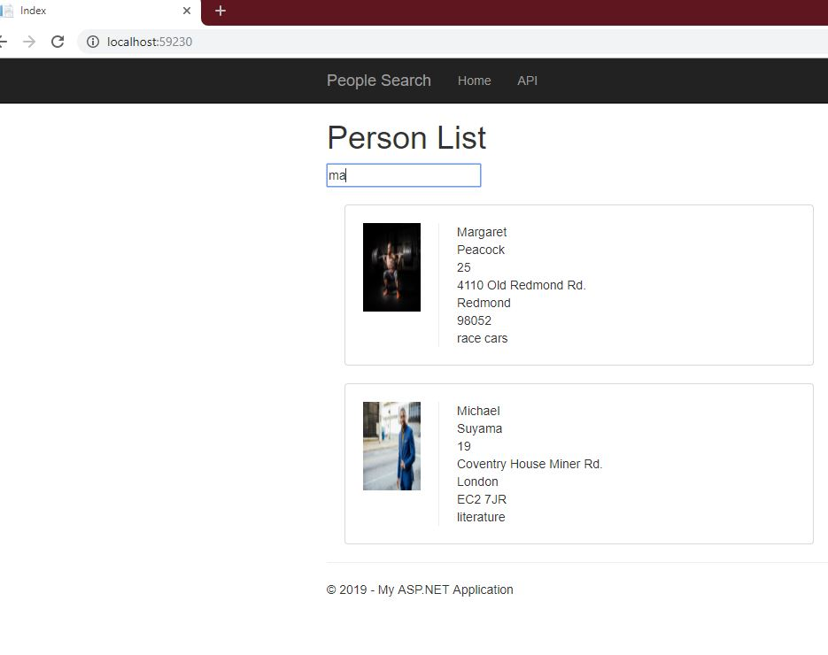

# Person-List-And-API
Gets a person list from an Web API that is populated from entity framework.  Searches on first and last name.

## TO RUN:
Extract the project from the zip file. 
Trying to run the project from the zip file will not load it properly. 

Run in visual studio as debug.  (Published version would have to be hosted and the API url updated in the react portion of the code.)

You may need to run a nuget package restore.
  
You shouldn't need to update the API url in the react portion of the code if debugging because the localhost and port are generated by visual studios.

Update the sql connection string in the web.config to the appropriate server.  

*It should create the db for you.  However you will need to set the server name and the user name and password with the appropriate permissions.* 

**DON'T SET IT TO AN EXISTING DB IT WILL DROP AND RECREATE IT IN ORDER TO CREATE AND SEED THE TABLE WITH DATA**

If you are not using windows authentication in the sql connection, you will need to make sure the server you are connecting to has Sql Server and Windows Authentication mode selected
in the server properties under Security. 

### In the web config in personapi
 <add name="PersonEntities" connectionString="metadata=res://*/Models.PersonModel.csdl|res://*/Models.PersonModel.ssdl|res://*/Models.PersonModel.msl;provider=System.Data.SqlClient;provider connection string=&quot;data source=volslaptop\SQLEXPRESS;initial catalog=violetstestdb2;user id=netdbuser;password=netdbuser;MultipleActiveResultSets=True;App=EntityFramework&quot;" providerName="System.Data.EntityClient"/>
### Change 
data source=volslaptop\SQLEXPRESS;user id=netdbuser;password=netdbuser;

### Should be able to leave this alone
initial catalog=violetstestdb2
As long as the user has db creation permissions.  

To run the tests the app.config in the test library will need to be updated as well.  

To host on IIS you would need to publish the project as a release version. Then set IIS to the publisher files, setup the app pool/bindings etc. You would then need to update the react.js to the new api url. 

### Discovered Issue

There appears to be a problem with the help page generation either when going to a previous version of .net framework or a previous version of Microsoft Visual Studios. The entire HelpPage folder can be deleted from PersonAPI/PersonAPI/Areas 
Which should allow the search page and API to run normally.  The API tab in the navigation will not longer be available but the api itself is still navigable via the url 

*Will remove the bad nav link and generated help pages tonight 8/28*

Specifics about connection string and the entity framework seeding in the visual studios project readme. 

Planned future enhancements
• Add search call to API
  • Queryable search call with Odata? 
• Remove and/or replace asp.net nav with react 
• Feature to add user
• Feature to delete user
• Feature to edit user
• Replace images with appropriately sized image
• CDN for images
• Labels for person details
• Additional responsive ui css for phone sizing
• Additional unit and UI tests 
